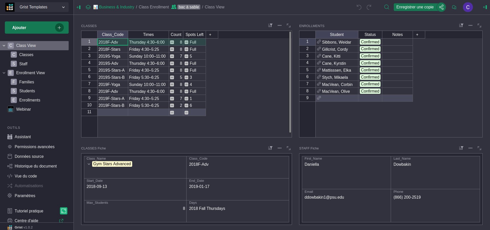
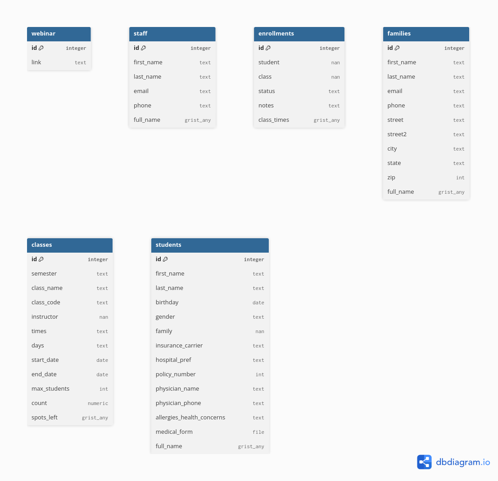

# grist-doc-to-dbml-parser

Parse a Grist document and generate DBML schema files.  
Generating DBML schema files allow users to explore data structures and links using ERD (Entity Relationnal Diagram) tools !  
From a Grist document like [https://templates.getgrist.com/doc/afterschool-program](https://templates.getgrist.com/doc/afterschool-program)  
  

We get the following ERD with all tables, columns and data types associated which help to understand datastructure without navigating through all pages and/or data sources.
  

## Features

- Extract table and column definitions from Grist `.db` documents
- Convert Grist data types to DBML types
- Generate DBML schema files
- Optional CSV export of the processed schema
- Automatic lowercase naming for tables and columns

## Installation

Clone this repository using Git:

```bash
git clone https://github.com/ytihianine/grist-doc-to-dbml-parser.git
cd grist-doc-to-dbml-parser/
```

Install the dependencies:

```bash
make setup-dev-env
```
If make is not already installed on your machine, you can follow this [guide for Windows](https://gnuwin32.sourceforge.net/packages/make.htm) or execute `sudo apt install make` on unix systems.

## Usage

First, download your Grist document.
> only the data structure is needed. (you can use the "Download only document structure, without data" option.)

Then, update the config values.
```python
from src.grist_doc_to_dbml import Config, convert_grist_schema_to_dbml

config = Config(
    grist_doc_path="path/to/your/grist_doc.db",
    dbml_output_path="path/to/your/output.dbml",
    csv_output_path="path/to/your/output.csv",
    export=True,  # Set to True to also export the schema to CSV
)

convert_grist_schema_to_dbml(config=config)
```

### Configuration

| Parameter | Description |
|---|---|
| `grist_doc_path` | Path to the Grist database file (`grist_doc.grist`) |
| `dbml_output_path` | Output path for the generated DBML file |
| `csv_output_path` | Output path for the optional CSV export |
| `export` | Set to `True` to also export the processed schema to CSV |

Finally, you can run the script !

### How it works

1. Reads table and column metadata from the Grist document
2. Filters out Grist internal tables (`summary`) and columns (you can overrides those values)
3. Maps Grist data types to DBML types
4. Generates a DBML file with table definitions and relationships

## Output

The tool generates a DBML file that can be used with tools like [DBML](https://dbdiagram.io/) or [dBeaver](https://dbeaver.io/) to visualize the database schema.

Example DBML output:

```dbml
Table mytable
{
	id integer [primary key]
	name text
	age int
	active boolean
}
```
